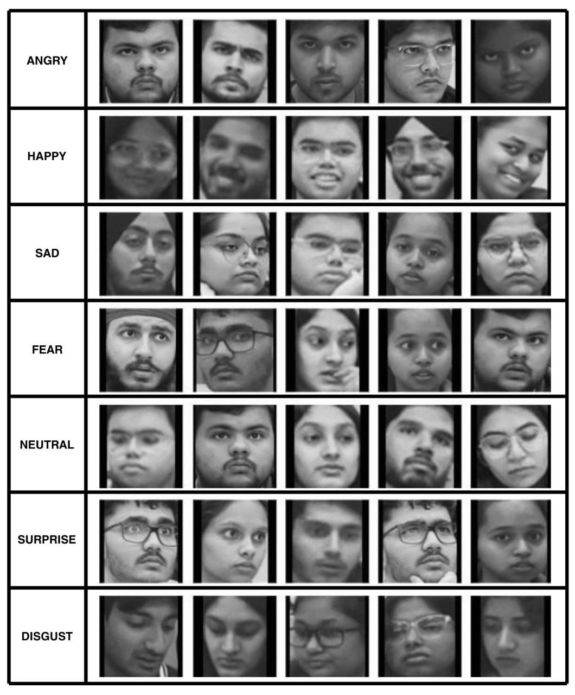
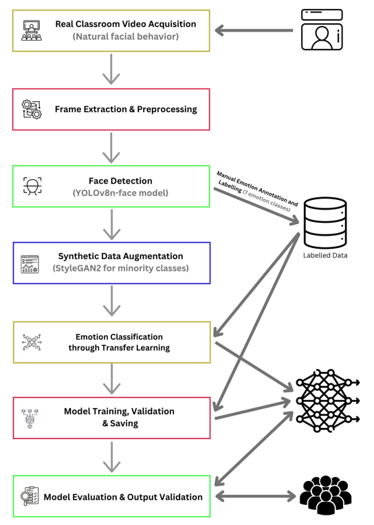
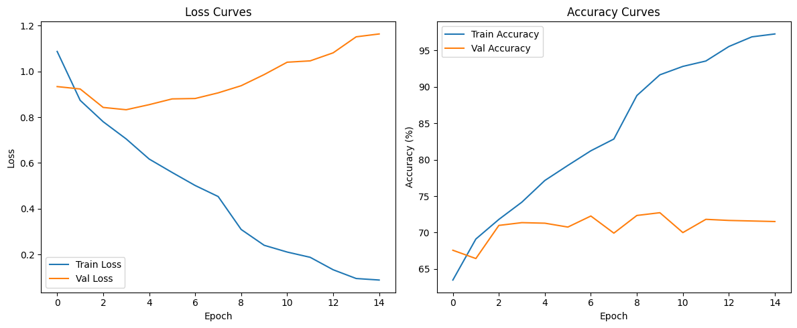
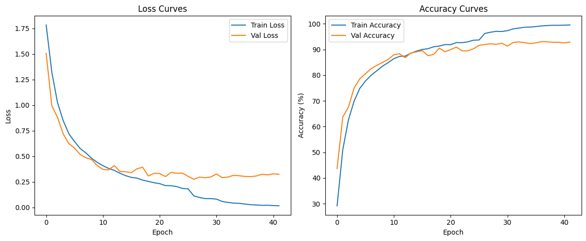

# EmotiLearn: Improving Classroom Learning Experience through Emotion-Centric AI

An intelligent, real-time facial emotion and engagement sensing platform for classroom learning.

## Overview

**EmotiLearn** is an AI-powered platform designed to improve classroom engagement and learning by providing real-time emotion and attention analytics to educators. Leveraging advanced facial expression recognition (FER) and deep learning, EmotiLearn enables immediate feedback so instructors can adjust teaching strategies dynamically, fostering a truly student-centered, adaptive classroom environment.

## Features

- **Real-Time Facial Emotion Recognition (FER)**: Detects seven emotions (happy, sad, anger, disgust, fear, surprise, neutral) from live classroom video using transfer-learned deep neural networks.

- **Student Engagement Analytics**: Maps recognized emotions to engagement levels to pinpoint disengaged or struggling students as lessons are delivered.

- **Dataset Balancing with Synthetic Data**: Uses StyleGAN2-ADA to create high-fidelity synthetic face images, overcoming class imbalance typical in real-world classroom datasets.

- **Custom Dataset**: Built with authentic, unscripted video recordings from classrooms, ensuring rich diversity, realism, and applicability to actual educational settings.

- **Immediate Instructor Feedback**: Provides visual analytics for instructors to adjust pace and pedagogy, increasing classroom effectiveness.

## Methodology

- **Acquisition**: Capture real, unscripted classroom sessions across different academic years and subjects.

- **Frame Extraction**: Sample every 240th frame for data diversity.

- **Face Detection & Preprocessing**: Detect faces (YOLOv8n-face), crop, and organize by metadata.

- **Manual Labeling**: Annotate each crop with an emotion (happy, sad, anger, disgust, fear, surprise, neutral).

- **Synthetic Data Augmentation**: Address class imbalance with synthetic faces (StyleGAN2-ADA).

- **Model Architecture**: Transfer learning using a pretrained FER model (HuggingFace), final layer fine-tuned for the custom dataset.

- **Training**: Weighted sampling, early stopping, and rigorous validation.

- **Evaluation**: Macro-averaged F1-score, per-class metrics, test against unseen video data.

## Sample Dataset

## Model Architecture

## Results

- **Pre-Balancing Model**: Accuracy 72.7%, strong bias towards 'neutral'.

- **Post-Balancing Model**: Accuracy 93%, Macro F1-score 0.93, per-class F1 > 0.90 for most classes.

- **Generalization**: Strong performance maintained on unseen classroom video frames (occlusions, side-poses, lighting variations).

## Citations & Acknowledgments
- **Based on research**: Tandon et al., "EmotiLearn: Improving Classroom Learning Experience through Emotion Centric Approach," Springer Lecture Notes in Computer Science, 2024.

- **Uses libraries**: PyTorch, OpenCV, StyleGAN2-ADA, YOLOv8n-face.

- Special thanks to the Thapar Institute of Engineering & Technology for dataset and research support.

## Collaborators & Co-Authors

- Vaibhav Tandon - [GitHub](https://github.com/vtandon1204) | [LinkedIn](https://www.linkedin.com/in/vtandon1204)
- Mukunj Mundhra - [GitHub](https://github.com/Mukunj-21) | [LinkedIn](https://www.linkedin.com/in/mukunj21)
- Diya Burman - [GitHub](https://github.com/diya-burman) | [LinkedIn](https://www.linkedin.com/in/diya-burman-13981b262)
- Kanchan Saini - [GitHub](https://github.com/ksaini762) | [LinkedIn](https://www.linkedin.com/in/kanchan-saini-a7463a267)
- Mridul Gupta - [GitHub](https://github.com/gupta1811) | [LinkedIn](https://www.linkedin.com/in/mridulgupta18)
- Simran Setia - [LinkedIn](https://www.linkedin.com/in/simran-setia-6a56b9108)
- Sachin Kansal - [LinkedIn](https://www.linkedin.com/in/dr-sachin-kansal-72983473)